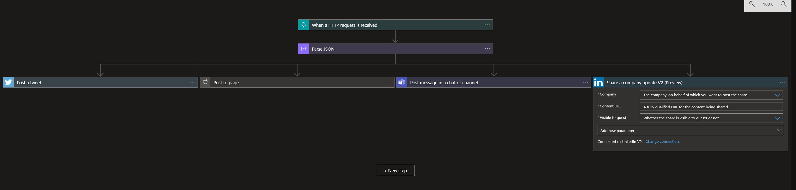

# HackathonPlasticPlug
In this worklflow I use the built in Twitter and Teams function to post a text. For facebook we need a custom connector. 

# File content

## PostonSocial.logicapp.json

This is the workflow definition of the logic app.

## apiDefinition.swagger.json

This is a alpha status swagger file for posting content over the facebook api
Source: https://github.com/microsoft/PowerPlatformConnectors/tree/master/custom-connectors/Facebook

## apiProperties.json

This is a settings file for the Custom connector.
Source: https://github.com/microsoft/PowerPlatformConnectors/tree/master/custom-connectors/Facebook

## Status
This is alpha status

## Workflow in detail

1. Http request with JSON payload in body. 
. 
{
    "text": ""
}

2. JSON will be parsed and converted to a string
3. In parallel the text will be posted on Twitter, LinkedIn, Teams, Facebook (todo)

## Restrictions
 At the moment TikTok provides no public API to post content. 